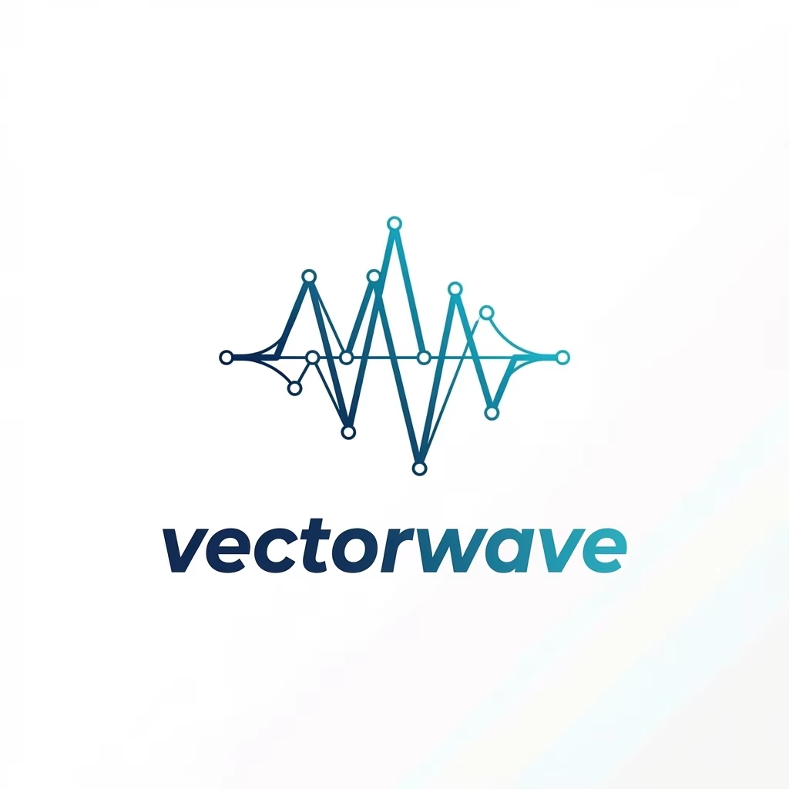
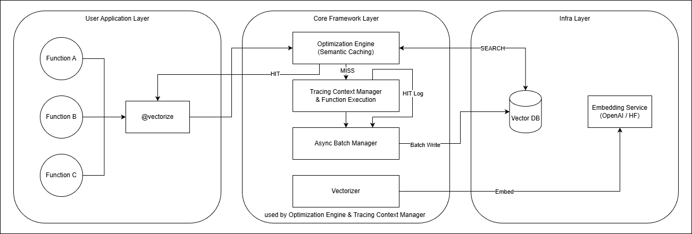
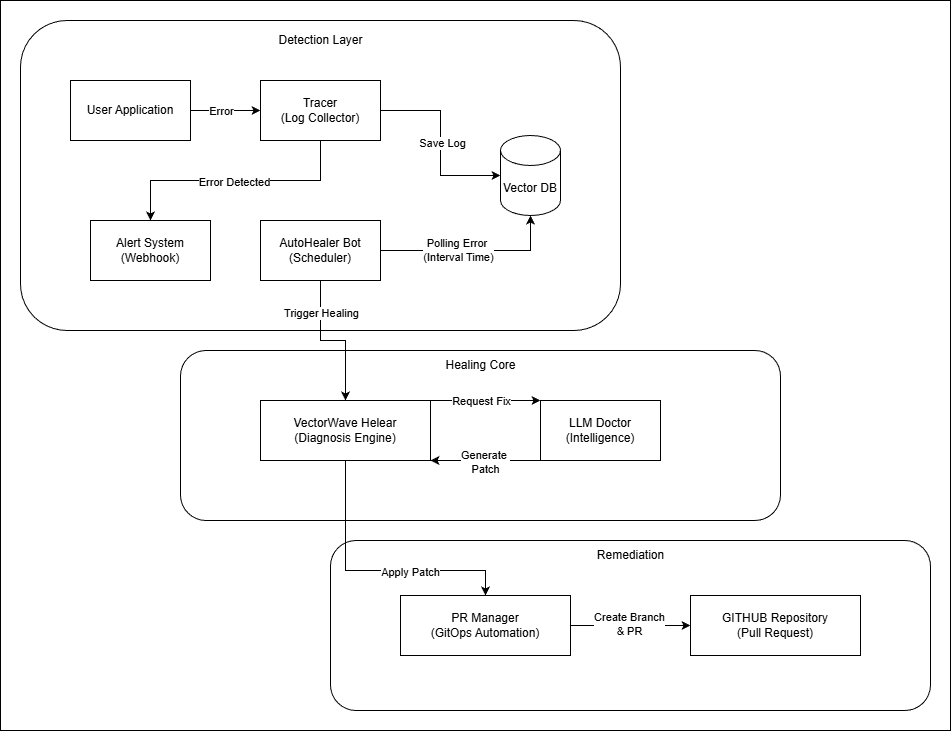
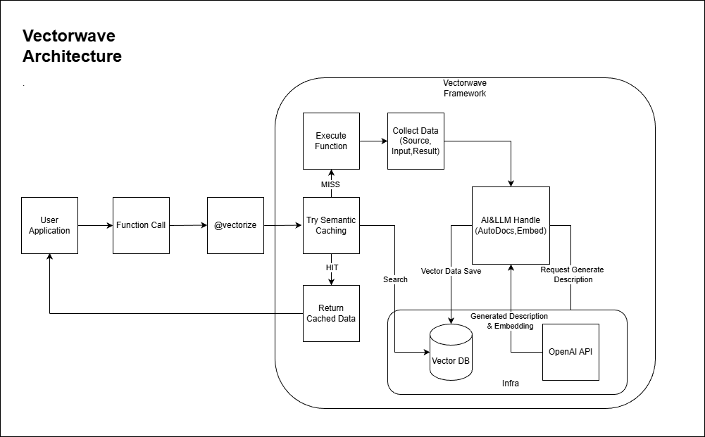
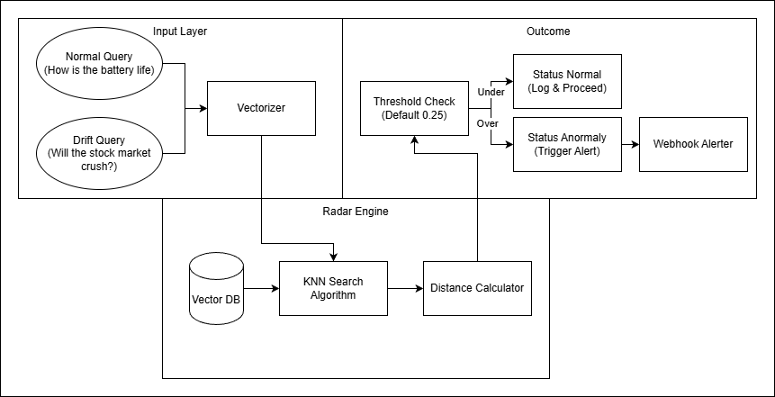

Need more information? Visit [here](https://www.cozymori.net/vectorwave)

# VectorWave


<br>**Seamless Auto-Vectorization Framework**

We transform volatile data that disappears the moment code is executed into a Searchable and Reusable permanent knowledge asset.

### Requirements

* **Python**: 3.10 ~ 3.13
* **Docker**: Required to run the Weaviate database.
* (Optional) **OpenAI API Key**: Required for AI auto-documentation and high-performance embedding.

### How to reach us

Have questions or found a bug? Please join our community.

* **GitHub Issues**: [https://github.com/cozymori/vectorwave/issues](https://github.com/cozymori/vectorwave/issues)

### Contributors
[See the contributors of vectorwave](https://github.com/Cozymori/VectorWave/graphs/contributors)<br>
VectorWave is an open-source project and we welcome your contributions.
Please refer to [CONTRIBUTING.md](https://www.google.com/search?q=https://github.com/cozymori/vectorwave/blob/main/CONTRIBUTING.md) in the GitHub repository.

---

## 🚀 What is VectorWave?

**VectorWave** is a unified framework designed to solve the "Efficiency vs. Reliability" dilemma in LLM-integrated applications. It introduces a new paradigm of **Execution-Level Semantic Optimization** combined with **Autonomous Self-Healing**.

Unlike conventional semantic caching tools that primarily focus on text similarity, **VectorWave** captures the entire **Function Execution Context**. It creates a permanent "Golden Dataset" from your successful executions and uses it to:

1.  **Slash Costs**: Serve cached results for semantically similar inputs, bypassing expensive computations.
2.  **Fix Bugs**: Automatically diagnose runtime errors and generate GitHub PRs using LLM.
3.  **Monitor Quality**: Detect when user inputs start drifting away from known patterns (Semantic Drift).

##  Architecture

VectorWave operates as a transparent layer between your application and the LLM/Infrastructure, handling everything from vectorization to GitOps automation.



### Core Components
* **Optimization Engine**: Intercepts function calls to check for semantic cache hits using HNSW indexes.
* **Trace Context Manager**: Collects execution logs, inputs, and outputs without modifying your code structure.
* **Self-Healing Pipeline**: An autonomous agent that wakes up on errors, diagnoses the root cause, and submits patches.

## 😊 Quick Start

You can attach VectorWave to any Python function using a simple decorator.

### 1. Prerequisites (Start Vector DB)

VectorWave requires a Vector Database (Weaviate) to store execution contexts.
Create a `docker-compose.yml` file and start the service:

```yaml
# docker-compose.yml
version: '3.4'
services:
  weaviate:
    command:
    - --host
    - 0.0.0.0
    - --port
    - '8080'
    - --scheme
    - http
    image: semitechnologies/weaviate:1.26.1
    ports:
    - 8080:8080
    - 50051:50051
    restart: on-failure:0
    environment:
      QUERY_DEFAULTS_LIMIT: 25
      AUTHENTICATION_ANONYMOUS_ACCESS_ENABLED: 'true'
      PERSISTENCE_DATA_PATH: '/var/lib/weaviate'
      DEFAULT_VECTORIZER_MODULE: 'none'
      ENABLE_MODULES: 'text2vec-openai,generative-openai'
      CLUSTER_HOSTNAME: 'node1'

```

Run the container:

```bash
docker-compose up -d

```

### 2. Install VectorWave

```bash
pip install vectorwave

```

### 3. Basic Usage (Semantic Caching)

Now, apply the `@vectorize` decorator to your functions.

```python
import time
from vectorwave import vectorize, initialize_database

# 1. (Optional) Set up your OpenAI Key for vectorization
# os.environ["OPENAI_API_KEY"] = "sk-..."

initialize_database()

# 2. Just add the @vectorize decorator!
@vectorize(semantic_cache=True, cache_threshold=0.95, auto=True)
def expensive_llm_task(query: str):
    # Simulate a slow and expensive API call
    time.sleep(2) 
    return f"Processed result for: {query}"

# First call: Runs the function (Cache Miss) -> Took 2.0s
print(expensive_llm_task("How do I fix a Python bug?"))

# Second call: Returns from Weaviate DB (Cache Hit) -> Took 0.02s!
# Even if the query is slightly different but semantically same.
print(expensive_llm_task("Tell me how to debug Python code."))

```

### 4. Self-Healing in Action

When your code breaks, VectorWave actively fixes it.

```python
# Suppose this function has a bug (ZeroDivisionError)
@vectorize(auto=True)
def risky_calculation(a, b):
    return a / b

# Triggering an error
risky_calculation(10, 0) 

```

**What happens next?**

1. **Detection**: The `AutoHealerBot` detects the `ZeroDivisionError`.
2. **Diagnosis**: It retrieves the source code and error stack trace.
3. **Fix**: It uses an LLM to generate a patch (adding `try-except` or input validation).
4. **Action**: A **Pull Request** is automatically created in your GitHub repository.




##  Key Features

### ⚡ Optimization Engine (Semantic Caching)

Don't pay for the same computation twice. VectorWave uses **Weaviate** vector database to store and retrieve function results based on meaning, not just exact string matching.

* **Latency**: Reduced from seconds to milliseconds.
* **Cost**: Up to 90% reduction in LLM token usage.




###  Self-Healing & GitOps

VectorWave doesn't just log errors; it acts on them.

* **Automated Root Cause Analysis (RCA)** using RAG.
* **GitOps Integration**: Generates actual code fixes and pushes them to a new branch.
* **Cooldown Mechanism**: Prevents spamming PRs for the same error.

###  Semantic Drift Radar

Detect when your users are asking things your model wasn't designed for.

* **Anomaly Detection**: Calculates the distance between new queries and your "Golden Dataset".
* **Alerting**: Sends notifications (e.g., Discord) when drift exceeds the threshold (default 0.25).




##  How does it work?

Unlike traditional Key-Value caching (e.g., Redis), VectorWave understands **Context**.

1. **Vectorization**: It converts function arguments into high-dimensional vectors using OpenAI or HuggingFace models.
2. **Search**: It performs an Approximate Nearest Neighbor (ANN) search in the vector store.
3. **Decision**:
* If a neighbor is found within the `threshold` -> **Return Cached Result**.
* If not -> **Execute Function** -> **Async Log to DB**.


##  Performance Benchmark

| Metric | Direct Execution | With VectorWave | Improvement |
| --- | --- | --- | --- |
| **Latency (Hit)** | ~2.5s (LLM API) | **~0.02s** | **125x Faster** |
| **Cost (Hit)** | $0.03 / call | **$0.00** | **100% Savings** |
| **Reliability** | Manual Fix Required | **Auto-PR Created** | **Autonomous** |

##  Feature Comparison

Why choose VectorWave over traditional semantic caches?

| Feature | Traditional Tools (e.g., GPTCache) | **VectorWave** |
| :--- | :---: | :---: |
| **Semantic Caching** | O (Text-based) | **O (Execution Context)** |
| **Self-Healing (Auto-Fix)** | X | **O (Autonomous)** |
| **GitOps (Auto-PR)** | X | **O (Seamless)** |
| **Semantic Drift Detection** | X | **O (Drift Radar)** |
| **Zero-Config Setup** | △ (Setup Required) | **O (Decorator)** |

## 😍 Contributing

We are extremely open to contributions! Whether it's a new vectorizer, a better healing prompt, or just a typo fix.
Please check our [Contribution Guide](./Contributing.md).
