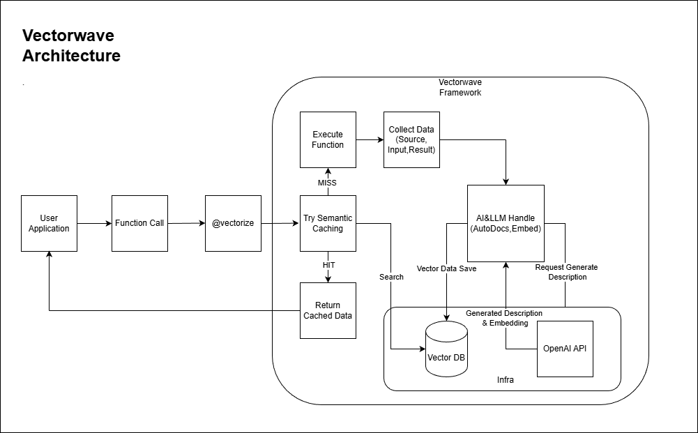
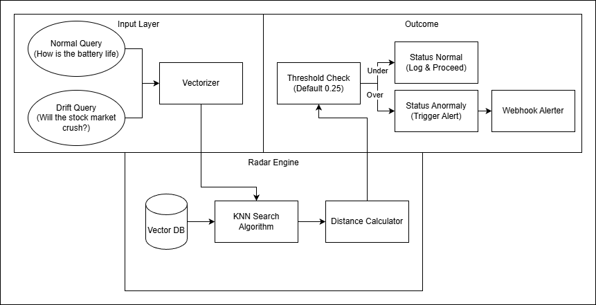
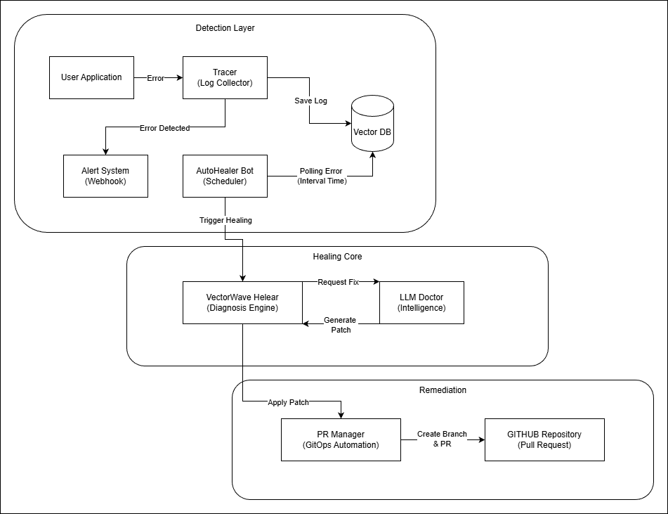
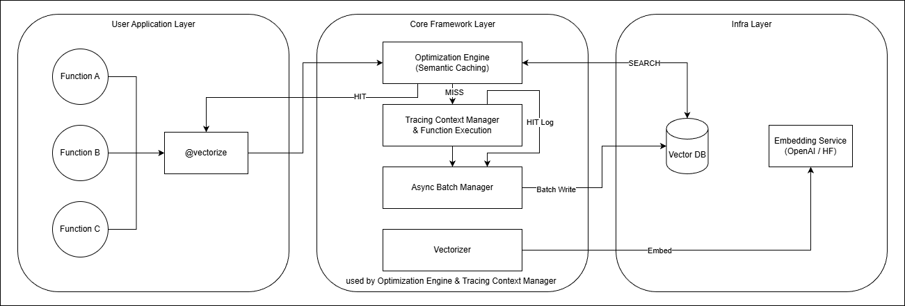

Need more information? Visit [here](https://www.cozymori.net/vectorwave)

# VectorWave


**Semantic caching and golden-data regression testing for your LLM functions — from one decorator.**

`@vectorize` captures every call your function makes — inputs, outputs, vectors, timing. That single execution history powers two things teams usually build and wire up separately: a **semantic cache** that skips re-running work you've already done, and a **pytest regression oracle** that catches the drift `assert a == b` can't. Drift detection and an experimental auto-diagnosis step fall out of the same history — but caching and testing are the core.

```bash
pip install vectorwave             # Pro mode (Weaviate)
pip install "vectorwave[lite]"     # Lite mode (LanceDB, no Docker)
pip install "vectorwave[otel]"     # + OpenTelemetry mirror
```

### Requirements

- **Python**: 3.10 – 3.13
- **Docker** (Pro mode only): runs the Weaviate database. Skip with Lite mode.
- **OpenAI API Key** (optional): for AI auto-documentation and high-performance embeddings.

### How to reach us

- **GitHub Issues**: [https://github.com/cozymori/vectorwave/issues](https://github.com/cozymori/vectorwave/issues)
- **Contributors**: [github.com/Cozymori/VectorWave/graphs/contributors](https://github.com/Cozymori/VectorWave/graphs/contributors)
- **Contributing guide**: [Contributing.md](./Contributing.md)

---

## 🚀 What is VectorWave?

VectorWave solves two problems that LLM-backed Python code keeps running into — with **one mechanism**:

1. **The same prompt is processed twice.** Direct LLM calls are expensive; the same semantic input usually has the same useful output. → **Semantic caching** with cosine-similarity lookup.
2. **You can't `assert a == b` on an LLM.** Output drifts a little every run. A regression that drops a clause looks identical to one that swaps a word. → **Pytest plugin** that compares to golden data by similarity, exact match, or LLM judge.

Both come from the same source: `@vectorize` records every call, and that **golden execution history** is reused as the cache *and* as the test oracle. Two more capabilities fall out of the same history — **semantic drift detection** and an **experimental automatic error diagnosis** step (opt-in; see below) — but caching and testing are the load-bearing core.

---

## 😊 Quick Start

### 1. Install

```bash
pip install vectorwave            # Pro mode (default; requires Weaviate)
# or
pip install "vectorwave[lite]"    # Lite mode — embedded LanceDB, no Docker
```

For Pro mode (Weaviate), bring your own instance or use the bundled dev stack:

```bash
vectorwave dev start              # starts Weaviate + console on localhost
```

For Lite mode, no setup beyond `pip install`:

```bash
export VECTORWAVE_MODE=lite
```

### 2. Two demos in one decorator

#### A. Semantic caching

```python
import time
from vectorwave import vectorize, initialize_database

initialize_database()   # Pro mode only; in Lite mode (VECTORWAVE_MODE=lite) skip this

@vectorize(semantic_cache=True, cache_threshold=0.95, capture_return_value=True)
def expensive_llm_task(query: str):
    time.sleep(2)
    return f"Processed result for: {query}"

# First call: cache miss → ~2.0s
print(expensive_llm_task("How do I fix a Python bug?"))

# Second call — different words, same meaning: cache hit → ~0.02s
print(expensive_llm_task("What's the best way to fix a bug in Python?"))
```

#### B. Pytest regression test

After your function has built up some golden executions, drop this in any test file:

```python
import pytest

@pytest.mark.vectorwave(
    target="myapp.expensive_llm_task",
    strategy="similarity",
    threshold=0.85,
    limit=10,
)
def test_no_regression():
    pass
```

`pytest` re-runs the function against captured inputs and fails the test if the new output drifts below the threshold. There is also a `vw_replay` fixture for programmatic inspection. Configuration layers from marker kwargs → `[tool.vectorwave.check."<target>"]` in `pyproject.toml` → global defaults.

To pick a threshold instead of guessing:

```bash
vectorwave check calibrate myapp.expensive_llm_task
# Reports p5/p10/p25/p50/p75/p95 of pairwise similarity and a recommended threshold.
# Use --rerun to measure the honest noise floor by re-executing the function.
```

> **Experimental — Automatic error diagnosis:** VectorWave can also read a function's runtime errors from its execution history and open a GitHub PR with a suggested patch (opt-in, Pro-only, needs an LLM + GitHub token). It's deliberately not a headline guarantee — see **Automatic Error Diagnosis & Patch PRs** under Key Features below.

---

## ⭐ Key Features

### ⚡ Semantic Caching

Cache LLM calls by meaning, not by exact string. Powered by HNSW vector indexes in Weaviate (Pro) or LanceDB (Lite). Threshold-based hit decisions per function.

- **Latency**: seconds → milliseconds.
- **Cost**: up to 90% fewer LLM tokens.



### 🧪 Pytest Regression Testing — *new in 1.0*

One marker, one threshold. Reuses your golden execution history as the test oracle.

```python
@pytest.mark.vectorwave(target="myapp.fn", strategy="similarity", threshold=0.85)
def test_fn_regression():
    pass
```

Three strategies: `exact`, `similarity`, `llm` (LLM-as-a-judge). See [ADR-0002](./docs/adr/0002-pytest-plugin-design.md) for the design rationale.

### 🎯 Threshold Calibration — *new in 1.0*

```bash
vectorwave check calibrate myapp.summarize          # cheap: output diversity
vectorwave check calibrate myapp.summarize --rerun  # honest: noise floor
```

Outputs a percentile distribution + a ready-to-paste `[tool.vectorwave.check."<target>"]` snippet. Recommends `strategy="exact"` for deterministic targets and `strategy="llm"` for highly variable ones.

### 💾 Lite Mode — *new in 1.0*

Embedded LanceDB backend. No Docker, no ports, single on-disk directory.

```bash
pip install "vectorwave[lite]"
export VECTORWAVE_MODE=lite
```

Trade-off documented in [ADR-0001](./docs/adr/0001-vectorstore-abstraction.md): Lite mode gives up server-side vectorization and distributed batching in exchange for zero setup.

### 📡 OpenTelemetry Mirror — *new in 1.0*

VW spans appear in your existing OTel stack (Datadog, Honeycomb, Jaeger, Tempo) alongside the rest of your service traces.

```bash
pip install "vectorwave[otel]"
export OTEL_SERVICE_NAME=myapp
```

Mirror, not replacement — VW's own pipeline keeps full semantic context. See [ADR-0003](./docs/adr/0003-opentelemetry-mirror.md).

### 📊 Semantic Drift Radar

Detect when your users start asking things your model wasn't trained for.

- **Anomaly Detection**: distance between new queries and the Golden Dataset.
- **Alerting**: Discord / webhook notifications past the drift threshold (default 0.25).



### 🧪 Automatic Error Diagnosis & Patch PRs — *experimental*

Opt-in and Pro-only. When a `@vectorize`d function raises, VectorWave can read the error from its execution history, ask an LLM for a fix, and open a **GitHub Pull Request** with the suggested patch — for you to review, never auto-merged.

- **RAG over your execution history** for root-cause context.
- **You stay in the loop**: it opens a PR, you approve. A cooldown prevents PR spam for the same error.
- **Requirements**: `OPENAI_API_KEY`, `GITHUB_TOKEN` + `GITHUB_REPO_NAME`, and Pro mode (Weaviate).

This is the most experimental part of VectorWave and is intentionally *not* one of its headline guarantees. Rationale and internals in [healer.py](./src/vectorwave/utils/healer.py).



---

## 🏗 Architecture

VectorWave sits as a transparent layer between your application and the LLM / infrastructure. Storage is pluggable behind a `VectorStore` protocol — Pro (Weaviate) and Lite (LanceDB) backends share every other component.



### Core Components

- **Optimization Engine**: intercepts function calls, checks semantic cache, returns a hit if one exists within threshold.
- **Trace Context Manager**: collects execution logs, inputs, outputs, vectors — without modifying your code structure.
- **VectorStore Layer**: backend-neutral storage protocol. New backends are a single-file addition.
- **Auto-Diagnosis Pipeline** *(experimental)*: on errors, diagnoses from history and opens a patch PR for review.
- **Check Plugin** (`vectorwave.check`): pytest entry-point + calibration CLI.

---

## ⏱ Performance

### Caching gains (Pro mode, real LLM call)

| Metric | Direct execution | With VectorWave | Improvement |
|---|---|---|---|
| **Latency (cache hit)** | ~2.5 s (LLM API) | **~0.02 s** | **125× faster** |
| **Cost (cache hit)** | $0.03 / call | **$0.00** | **100% savings** |

### Wrapper overhead (`@vectorize` on a bare Python function)

Median time per call, measured via `pytest src/tests/benchmarks/ --benchmark-only` on Darwin / CPython 3.12 / Apple Silicon:

| Variant | Median | Overhead vs bare |
|---|---|---|
| bare Python function (anchor) | 33.8 ns | 1× |
| `@vectorize`, no capture | **11.4 µs** | ~338× |
| `@vectorize` + `capture_return_value` | 13.9 µs | ~411× |
| `@vectorize` + `capture_inputs` | 14.8 µs | ~439× |

For any function doing >1 ms of real work, the wrapper tax is in the noise. The 33.8 ns baseline is an empty function — the "× vs bare" numbers look dramatic until you remember that.

### Embeddings: how many, and how to keep them cheap

VectorWave embeds **input text**, and does so sparingly — one small vector per stored call:

| Per `@vectorize` call | Embeddings |
|---|---|
| cache hit (`semantic_cache=True`) | **1** — the lookup vector is reused for the hit log |
| cache miss (`semantic_cache=True`) | **2** — one to look up, one to store the new execution |
| logging only (no `semantic_cache`) | **1** — the stored execution vector |
| a call that errors | **1** — the error message (used for error search) |

Function **registration** embeds a one-line description once per function and caches it (`.vectorwave_functions_cache.json`) — it does *not* re-embed on every call. Drift detection reuses the stored vector, so it adds **zero** extra embeddings.

**Keeping it cheap:**

- `VECTORIZER=huggingface` (default) — embeddings run locally on CPU with `all-MiniLM-L6-v2` (384-dim). No API calls, no per-call cost, nothing leaves the process.
- `VECTORIZER=weaviate_module` — Weaviate embeds server-side (one round trip, no Python-side model).
- `VECTORIZER=openai_client` — each embedding is an OpenAI API call (highest quality, but real cost + latency per call). Reserve it for when you need it.
- `VECTORIZER=none` — no embeddings at all (disables semantic caching and drift).

Only calibration batches embeddings (`embed_batch`); the per-call path embeds one text at a time, and the batch manager batches **DB writes**, not embeddings.

---

## 🆚 How does VectorWave compare?

| Feature | GPTCache | ragas / deepeval / promptfoo | **VectorWave** |
| :--- | :---: | :---: | :---: |
| Semantic caching (execution-level) | O | X | **O** |
| Golden-data regression testing | X | O | **O** |
| Pytest integration | X | △ | **O (marker + fixture)** |
| Threshold calibration (CLI) | X | △ | **O (percentile-backed)** |
| Auto error diagnosis & patch PR *(experimental)* | X | X | **O** |
| OpenTelemetry mirror | X | X | **O** |
| Drift detection | X | △ | **O** |
| Zero-config local mode | △ | △ | **O (Lite mode)** |

Most teams pick a caching tool *and* a regression-testing tool *and* an observability integration and wire them up themselves. VectorWave gives you one decorator and one config file.

---

## 🧠 How it works

Unlike traditional Key-Value caching (e.g., Redis), VectorWave understands **Context**.

1. **Vectorization**: function arguments → high-dimensional vectors via OpenAI / HuggingFace.
2. **Search**: Approximate Nearest Neighbor (ANN) lookup in the vector store.
3. **Decision**:
   - Neighbor within `threshold` → **return cached result**.
   - Otherwise → **execute function** → **async-log to DB** (the new entry becomes future golden data).

Golden executions feed the regression-test layer. Drift over time feeds the radar. Errors feed the experimental auto-diagnosis step. **Same substrate — caching and testing at the core, the rest derived.**

---

## 🔒 Data Handling

VectorWave stores what your functions do, so it's worth knowing exactly what lands where:

- **What's captured**: per call, the function's inputs (with `capture_inputs`/`replay`), return value (with `capture_return_value`), a vector embedding of the input text, and timing/status metadata. The function's **source code** is also stored (used by regression replay and the experimental auto-diagnosis).
- **Redaction**: before anything is stored, values whose keys match `sensitive_keys` are replaced with `[MASKED]` (defaults: `password`, `api_key`, `token`, `secret`, `auth_token`). Add your own PII/secret keys via settings — masking runs in the `mask_and_serialize` path on the way in.
- **Where it lives**: **Lite mode** keeps everything in a local on-disk directory (`.vectorwave/`) — nothing leaves your machine. **Pro mode** writes to the Weaviate instance *you* run.
- **Embeddings & third parties**: with `VECTORIZER=huggingface`, embeddings are computed **locally**; with `openai_client` or Weaviate's `text2vec-openai`, the input text is sent to OpenAI to be embedded. The experimental auto-diagnosis also sends source + error context to an LLM.
- **Retention**: 1.0 has no automatic TTL — you own the store's lifecycle. Drop collections to delete history; back up the Weaviate volume (Pro) or the `.vectorwave/` directory (Lite) as you would any datastore.

Treat the execution store like application logs that may contain user data: scope `sensitive_keys` to your fields, and prefer Lite mode with local embeddings when inputs are sensitive.

---

## 📚 Further reading

- [CHANGELOG.md](./CHANGELOG.md) — release history.
- [docs/adr/](./docs/adr/) — architectural decision records.
- [Contributing.md](./Contributing.md) — how to set up the dev environment and submit a PR.

## 😍 Contributing

We are extremely open to contributions — new vectorizers, better diagnosis prompts, additional backends, doc improvements, typo fixes. Please read the [Contributing guide](./Contributing.md) before opening a PR.
